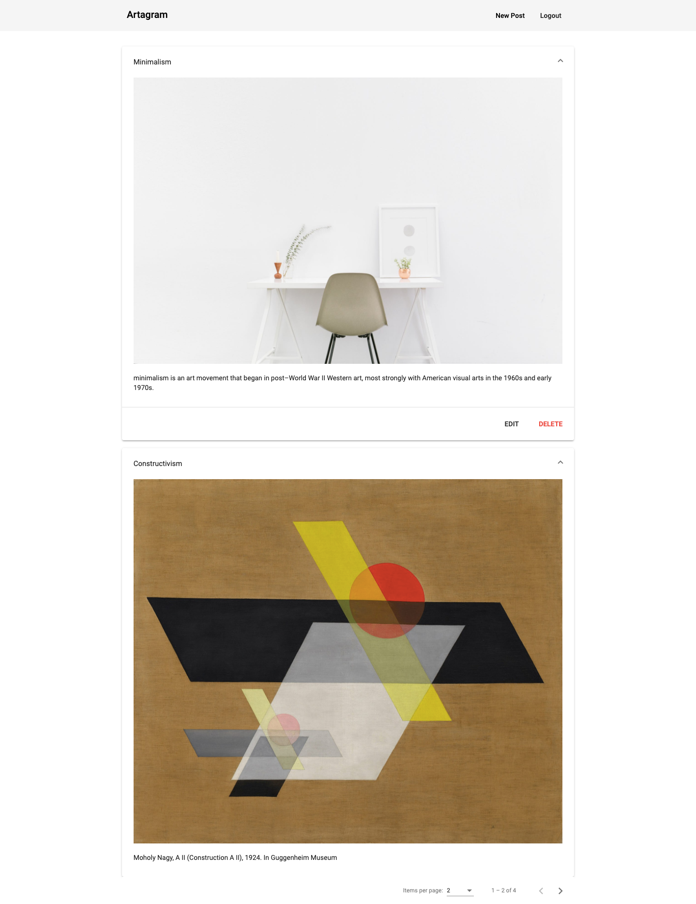
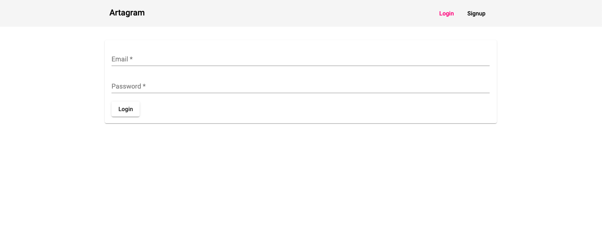
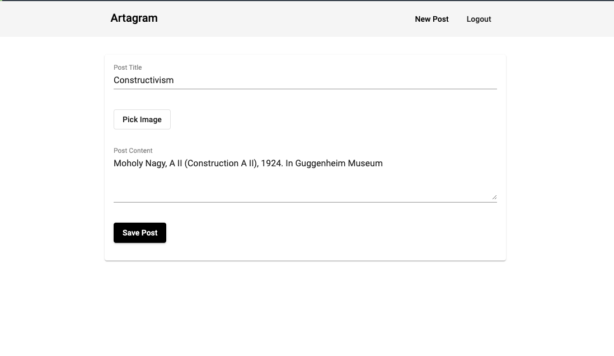

# Artagram

This project was created with MEAN (Mongodb, Express, Angular, and Node) stack.

Artagram is a web application for displaying art pieces that are gathered by collective efforts. It allows multiple users to sign up, create post, and browse other people's posts.

Online website: http://www.art-agram.com

## Features
- Allows multiple users to sign up
- Everyone can see all the posts
- After signed in, users can also see recent updates on the website, e.g. someone create a new project, someone signed up
- After signed in, users can create post, edit, or delete their own posts but not others'

### How to run the project locally

This project was generated with [Angular CLI](https://github.com/angular/angular-cli) version 8.3.22.

### Development server

Run `ng serve` for a dev server. Navigate to `http://localhost:4200/`. The app will automatically reload if you change any of the source files.

### Code scaffolding

Run `ng generate component component-name` to generate a new component. You can also use `ng generate directive|pipe|service|class|guard|interface|enum|module`.

### Build

Run `ng build` to build the project. The build artifacts will be stored in the `dist/` directory. Use the `--prod` flag for a production build.

### Further help

To get more help on the Angular CLI use `ng help` or go check out the [Angular CLI README](https://github.com/angular/angular-cli/blob/master/README.md).

## Screenshots
###Main Page

Only the posts created by logined users will have 'edit' and 'delete' buttons
 
###Login page

###Create or edit page

